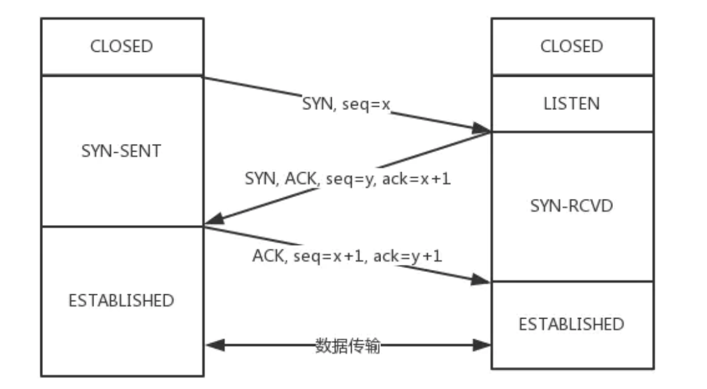

### TCP协议

------

#### 1. TCP与UDP的区别

TCP是一个面向连接的，可靠的，基于字节流的传输层协议，而UDP是一个面向无连接的传输层协议。

具体分析，TCP主要有三个核心特征：

1. 面向连接，所谓连接，指的是客户端和服务端的连接，在双方通信之前，TCP需要三次握手才能建立连接，而UDP没有这个建立连接的过程
2. 可靠性，TCP花了很多功夫保证连接的可靠性，他会精准的记录哪些数据发送了，哪些数据被接收了，哪些数据没有被接受，而且保证包按顺序到达，当意识到丢包或者网络不佳时，TCP会自行调整自己的行为，控制自己的发送速度或者重发，即有状态且可控制。而UDP没有状态不可控
3. 面向字节流，UDP数据是基于数据报的，仅仅继承了IP层的特性，而TCP为了维护状态，将IP包变成了字节流。

#### 2. TCP三次握手

三次握手，要确认双发都具有收和发的能力

- 最开始的时候双方都是closed的状态，然后服务端开始兼听监听某个端口，进入listen状态。

- 接着客户端主动发起连接，发送SYN，seq=x，自己变成SYN-SENT
- 服务端收到后，返回SYN和ACK，seq=y，ack=x+1，自己变成SYN-RCVD
- 客户端收到服务端的消息后，发送ACK，seq=x+1，ack=y+1，自己变成ESTABLISHED
- 服务端收到客户端的消息后，自己变成了ESTABLISHED

注意：

SYN是需要消耗序列号的，下一次发送对应的ACK要加1，**凡是需要对端确认的，一定消耗TCP报文的序列号**，SYN需要对端确认，而ACK不需要，因此SYN消耗一个序列号，而ACK不需要

#### 3. 为什么是三次，而不是两次，四次？

**两次**：两次无法确认客户端是否具有接受能力。如果是两次，发送了SYN报文，但是这个包滞留在网络中没到达，TCP会以为丢包，重传，两次握手建立了连接，但是关闭连接后，滞留在网络中的数据报如果到达了服务端，服务端收到了，然后又会发送相应的数据，连接建立，但是此时客户端已经关闭了连接，就会造成连接资源的浪费。

**四次**：四次及以上都可以，但是三次就够了，没必要再多了

#### 4. 三次握手可以携带数据吗

第三次握手的时候可以携带，前两次不可以。如果前两次握手能携带数据，那么一旦有人想要攻击服务器，那么他会在第一次握手的SYN中放大量数据，那么服务器就会消耗更多时间和内存处理这些数据，增大了服务器被攻击的风险。第三次握手的hi后客户端已经处于了ESTABLISHED的状态，已经能够确认服务器收和发的能力正常，相对安全，可以携带数据。

#### 5. 四次挥手

- 刚开始双方处于ESTABLISHED状态
- 客户端发送FIN报文，seq = p，状态变成了FIN-WAIT-1
- 服务端收到后，发送ACK确认，ack = p + 1，然后进入CLOSED-WAIT状态
- 客户端收到后，进入FIN-WAIT-2状态
- 等数据都处理完，服务端再发送FIN，ACK，seq = q，ack=p+1，进入LAST-ACK状态
- 客户端收到上一段报文后，客户端进入TIME-WAIT状态（等待2MSL），然后发送ACK，ack=q+1
- 服务端收到后进入CLOSED状态

客户端需要等2MSL( Maximum Segment Lifetime，报文最大生存时间),如果在这个时间段里面**没有收到**服务端重发的请求，就表示ACK到达成功，挥手结束，否则客户端重新发送ACK。
##### 等待2MSL的意义
如果不等待，意思是客户端直接跑路，当服务端还有很多数据包要发送给客户端，而且还在路上，如果客户端的端口此时刚好被新的应用占用，那么就收到了无用数据包，会造成数据包混乱。等2个MSL一是确保四次挥手中主动关闭的一方发送的ACK报文能最终到达终端，二是确保如果对方还有报文要发过来的话能到达。

#### 6.为什么是四次挥手而不是三次
服务端在接收到FIN后必须要等到服务端所有的报文都发送完毕了才能FIN，因此就是要先发一个ACK表示我已经收到客户端的FIN，然后确认自己没有数据要发了，再发FIN。这就造成了四次挥手。
如果至三次的话，也就是服务端将ACK和FIN合并为一次挥手，这个时候长时间的延迟会导致客户端以为FIN没到达服务端，然后会再重发FIN。

#### 7. 半连接队列和SYN FLOOD攻击
三次握手前，服务端的状态从CLOSED变为LISTEN，同时，内部创建了两个队列，半连接队列和全连接队列。
##### 半连接队列为SYN队列
当客户端发送SYN到服务器后，服务端收到了回复ACK和SYN，状态变成了`SYN_RCVD`,这个链接就被推入到了**SYN队列**
##### 全连接位ACCEPT队列
当客户端返回ACK后，服务端接收后，三次握手完成，这个时候连接等待被具体的应用取走，在被取走前，他被扔进了了TCP队列维护，也就是全连接队列(Accept Queue)。
##### SYN Flood 攻击原理
SYN FLOOD属于典型的DOS攻击，原理是，客户端在短时间内伪造大量不存在的IP地址，并向服务端发送SYN，对于服务端而言存在两个危险：
1）处理大量的SYN包并返回对应的ACK，会有大量的链接处于`SYN_RCVD` 状态，从而占满整个半连接队列，无法处理正常的请求。
2）不存在的IP会导致服务端长时间收不到客户端的ACK，服务端会不断地重发数据，直到资源耗尽。

#### 8.如何应对SYN FLOOD
1. 增加SYN连接，也就是增加半连接队列的容量
2. 减少SYN+ACK重试的次数，避免大量的超时重发
3. 利用SYN COOKIE。服务端接收到SYN后不会立即分配链接的资源，而是根据这个SYN计算出一个cookie，将这个cookie和第二次握手一起发给客户端，客户端回复ACK的时候就带上这个cookie，服务器只有验证这个cookie是合法的才回去分配资源连接。

#### 9.TCP快速打开的原理（TFO）
三次握手的优化版，也就是 TCP 快速打开(TCP Fast Open, 即TFO)，利用SYN COOKIE
1）TFO流程
首轮三次握手：
首先客户端发送SYN给服务端，服务端接收到后，通过这个SYN计算出一个SYN COOKIE，将这个COOKIE放到TCP的FAST OPEN选项中，然后给客户端返回。
客户端拿到这个cookie值并缓存下来，后面正常完成三次握手
后面的三次握手：
客户端将之前缓存的COOKIE，和SYN，HTTP请求一起发给服务端，服务端验证了COOKIE的合法性后，就正常返回HTTP响应。

## TCP 数据包的编号 （SEQ）
发送的时候，TCP 协议为每个包编号(sequence number)，以便接收的一方按照顺序还原。万一发生丢包，
也可以知道丢失的是哪一个包。
第一个包的编号是一个随机数。为了便于理解，这里就把它称为1号包。假定这个包的负载长度是100字节，那么可以推算出下一个包的编号应该是101。这就是说，每个数据包都可以得到两个编号：自身的编号，以及下一个包的编号。接收方由此知道，应该按照什么顺序将它们还原成原始文件。
## 慢启动和ACK
- TCP协议为了做到效率与可靠性的统一，设计了一个慢启动(slow start)机制。开始的时候，发送得较慢，然后根据丢包的情况，调整速率，如果不丢包，就加快发送速度；如果丢包，就降低发送速度。
- Linux内核里面设定了(TCP_INIT_CWND)，刚开始通信的时候，发送方一次性发送10个数据包，“发送窗口”的大小为10.
  然后停下来，等待收方的确认，再继续发送。
- 接收方每收到两个TCP数据包，就要发送一个确认(acknowledgement)消息。
	- 期待要收到下一个数据包的编号
	- 接收方的接收窗口的剩余容量
- 发送方有了这两个信息，再加上自己已经发出的数据包的最新编号，就会推测出接收方大概的接收速度，从而降低或者增加发送速率，这杯称为“发送窗口”，这两个窗口的大小是可变的。
