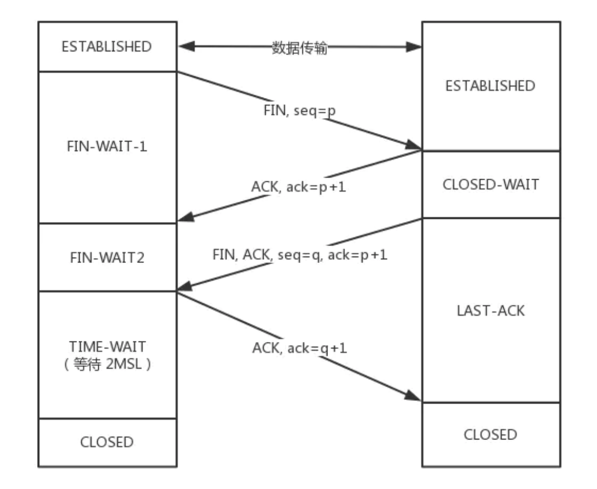
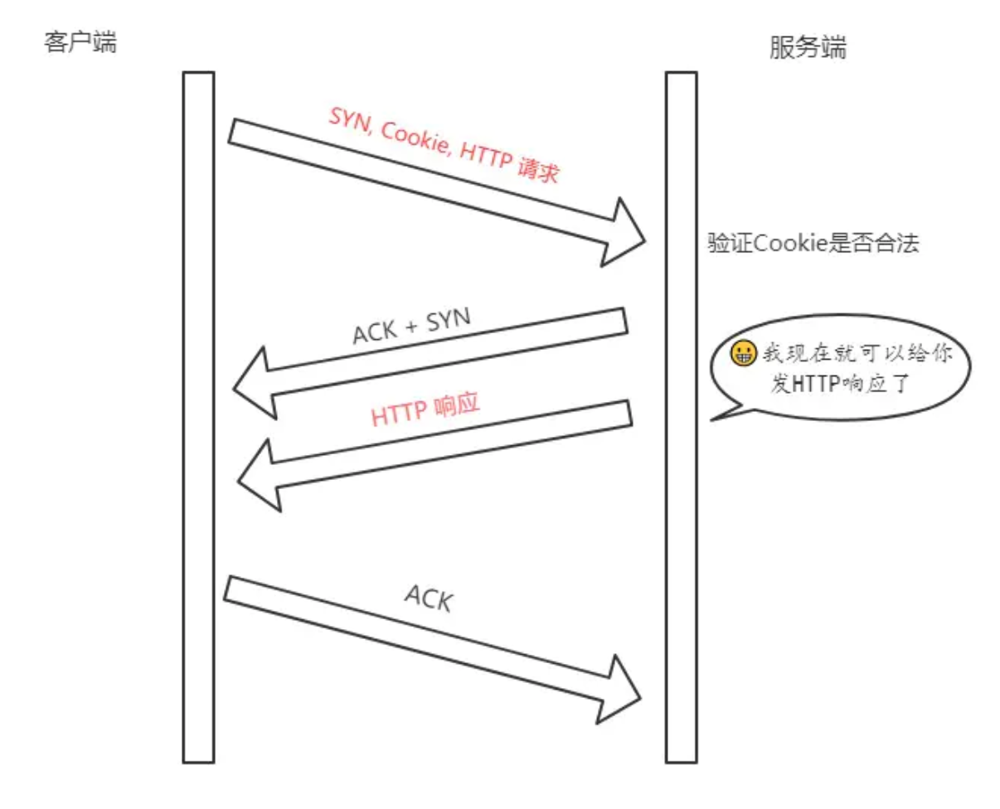
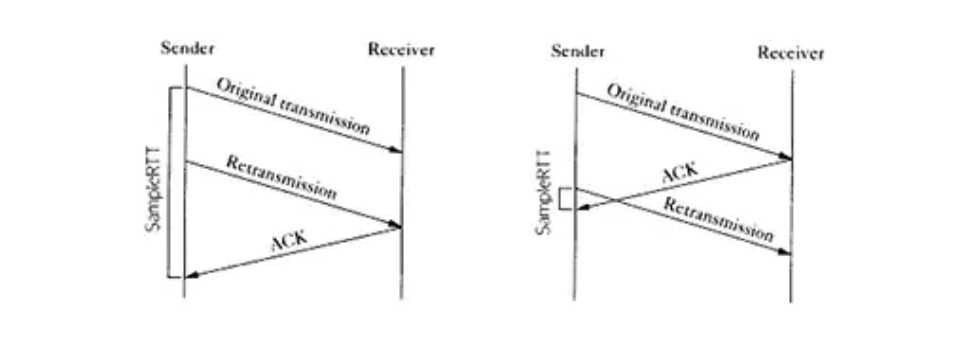
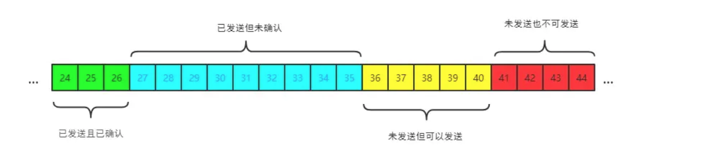
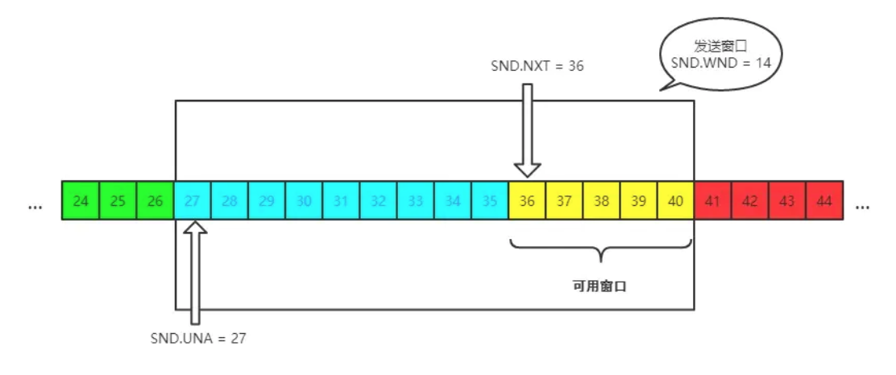
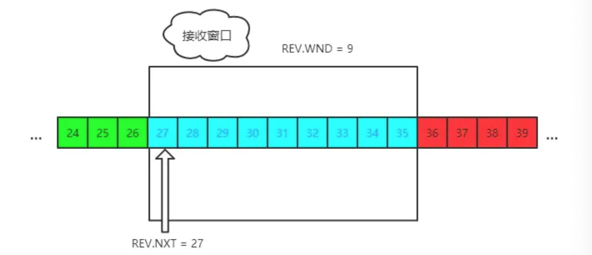

### TCP协议

------

#### 1. TCP与UDP的区别

TCP是一个面向连接的，可靠的，基于字节流的传输层协议，而UDP是一个面向无连接的传输层协议。

具体分析，TCP主要有三个核心特征：

1. 面向连接，所谓连接，指的是客户端和服务端的连接，在双方通信之前，TCP需要三次握手才能建立连接，而UDP没有这个建立连接的过程
2. 可靠性，TCP花了很多功夫保证连接的可靠性，他会精准的记录哪些数据发送了，哪些数据被接收了，哪些数据没有被接受，而且保证包按顺序到达，当意识到丢包或者网络不佳时，TCP会自行调整自己的行为，控制自己的发送速度或者重发，即有状态且可控制。而UDP没有状态不可控
3. 面向字节流，UDP数据是基于数据报的，仅仅继承了IP层的特性，而TCP为了维护状态，将IP包变成了字节流。

#### 2. TCP三次握手

三次握手，要确认双发都具有收和发的能力


- 最开始的时候双方都是closed的状态，然后服务端开始兼听监听某个端口，进入listen状态。

- 接着客户端主动发起连接，发送SYN，seq=x，自己变成SYN-SENT
- 服务端收到后，返回SYN和ACK，seq=y，ack=x+1，自己变成SYN-RCVD
- 客户端收到服务端的消息后，发送ACK，seq=x+1，ack=y+1，自己变成ESTABLISHED
- 服务端收到客户端的消息后，自己变成了ESTABLISHED

注意：

SYN是需要消耗序列号的，下一次发送对应的ACK要加1，**凡是需要对端确认的，一定消耗TCP报文的序列号**，SYN需要对端确认，而ACK不需要，因此SYN消耗一个序列号，而ACK不需要

#### 3. 为什么是三次，而不是两次，四次？

**两次**：两次无法确认客户端是否具有接受能力。如果是两次，发送了SYN报文，但是这个包滞留在网络中没到达，TCP会以为丢包，重传，两次握手建立了连接，但是关闭连接后，滞留在网络中的数据报如果到达了服务端，服务端收到了，然后又会发送相应的数据，连接建立，但是此时客户端已经关闭了连接，就会造成连接资源的浪费。

**四次**：四次及以上都可以，但是三次就够了，没必要再多了

#### 4. 三次握手可以携带数据吗

第三次握手的时候可以携带，前两次不可以。如果前两次握手能携带数据，那么一旦有人想要攻击服务器，那么他会在第一次握手的SYN中放大量数据，那么服务器就会消耗更多时间和内存处理这些数据，增大了服务器被攻击的风险。第三次握手的hi后客户端已经处于了ESTABLISHED的状态，已经能够确认服务器收和发的能力正常，相对安全，可以携带数据。

#### 5. 四次挥手


- 刚开始双方处于ESTABLISHED状态
- 客户端发送FIN报文，seq = p，状态变成了FIN-WAIT-1
- 服务端收到后，发送ACK确认，ack = p + 1，然后进入CLOSED-WAIT状态
- 客户端收到后，进入FIN-WAIT-2状态
- 等数据都处理完，服务端再发送FIN，ACK，seq = q，ack=p+1，进入LAST-ACK状态
- 客户端收到上一段报文后，客户端进入TIME-WAIT状态（等待2MSL），然后发送ACK，ack=q+1
- 服务端收到后进入CLOSED状态

客户端需要等2MSL( Maximum Segment Lifetime，报文最大生存时间),如果在这个时间段里面**没有收到**服务端重发的请求，就表示ACK到达成功，挥手结束，否则客户端重新发送ACK。
##### 等待2MSL的意义
如果不等待，意思是客户端直接跑路，当服务端还有很多数据包要发送给客户端，而且还在路上，如果客户端的端口此时刚好被新的应用占用，那么就收到了无用数据包，会造成数据包混乱。等2个MSL一是确保四次挥手中主动关闭的一方发送的ACK报文能最终到达终端，二是确保如果对方还有报文要发过来的话能到达。

#### 6.为什么是四次挥手而不是三次
服务端在接收到FIN后必须要等到服务端所有的报文都发送完毕了才能FIN，因此就是要先发一个ACK表示我已经收到客户端的FIN，然后确认自己没有数据要发了，再发FIN。这就造成了四次挥手。
如果至三次的话，也就是服务端将ACK和FIN合并为一次挥手，这个时候长时间的延迟会导致客户端以为FIN没到达服务端，然后会再重发FIN。

#### 7. 半连接队列和SYN FLOOD攻击
三次握手前，服务端的状态从CLOSED变为LISTEN，同时，内部创建了两个队列，半连接队列和全连接队列。
##### 半连接队列为SYN队列
当客户端发送SYN到服务器后，服务端收到了回复ACK和SYN，状态变成了`SYN_RCVD`,这个链接就被推入到了**SYN队列**
##### 全连接位ACCEPT队列
当客户端返回ACK后，服务端接收后，三次握手完成，这个时候连接等待被具体的应用取走，在被取走前，他被扔进了了TCP队列维护，也就是全连接队列(Accept Queue)。
##### SYN Flood 攻击原理
SYN FLOOD属于典型的DOS攻击，原理是，客户端在短时间内伪造大量不存在的IP地址，并向服务端发送SYN，对于服务端而言存在两个危险：
1）处理大量的SYN包并返回对应的ACK，会有大量的链接处于`SYN_RCVD` 状态，从而占满整个半连接队列，无法处理正常的请求。
2）不存在的IP会导致服务端长时间收不到客户端的ACK，服务端会不断地重发数据，直到资源耗尽。

#### 8.如何应对SYN FLOOD
1. 增加SYN连接，也就是增加半连接队列的容量
2. 减少SYN+ACK重试的次数，避免大量的超时重发
3. 利用SYN COOKIE。服务端接收到SYN后不会立即分配链接的资源，而是根据这个SYN计算出一个cookie，将这个cookie和第二次握手一起发给客户端，客户端回复ACK的时候就带上这个cookie，服务器只有验证这个cookie是合法的才回去分配资源连接。

#### 9.TCP快速打开的原理（TFO）

三次握手的优化版，也就是 TCP 快速打开(TCP Fast Open, 即TFO)，利用SYN COOKIE
**1）TFO流程**
首轮三次握手：
首先客户端发送SYN给服务端，服务端接收到后，通过这个SYN计算出一个SYN COOKIE，将这个COOKIE放到TCP的FAST OPEN选项中，然后给客户端返回。
客户端拿到这个cookie值并缓存下来，后面正常完成三次握手
后面的三次握手：
客户端将之前缓存的COOKIE，和SYN，HTTP请求一起发给服务端，服务端验证了COOKIE的合法性后，就正常返回HTTP响应。如果合法，那么就返回`SYN+ACK`，不合法就丢弃。后面客户端的`ACK`还得传过来的，三次握手的本质不变。

流程图如下：



注意：客户端最后握手的ACK不一定要等到服务端的HTTP响应到达后才返回ACK，这是不相关的两个过程。

**2）TFO的优势**

TFO的优势在于后面的握手缓解，服务端验证cookie通过后，直接返回http，充分利用了**1** **个RTT**(Round-Trip Time，往返时延)提前传输数据，累积起来还是很节省时间的。

#### 10. TCP报文中的时间戳的作用

timestamp是TCP报文头得一个可选项，一共占10个字节，格式如下：

```js
kind(1 字节) + length(1 字节) + info(8 个字节)
```

> 其中 kind = 8， length = 10， info 有两部分构成: **timestamp**和**timestamp echo**，各占 4 个字节。

时间戳主要是用来解决两个问题的：

- 计算往返时延RTT（Round-Trip Time）

- 防止序列号的回绕问题

  **计算往返时延 RTT**

  没有时间戳的时候，计算RTT会出现下面的问题：

  



左图RTT明显偏大，应该采用第二次发送时间为开始时间，右图有明显嫌小，应该采用第一次发送的时间为开始时间。

时间戳很好的解决了这个问题。比如现在a向b发送了一个报文s1，b向a回复了一个含有ACK的报文`s2`:

- **step 1:** a 向 b 发送的时候， timestamp 中存放的内容就是 a 主机发送时的内核时刻 `ta1` 。
- **step 2:** b 向 a 回复 s2 报文的时候， timestamp 中存放的是 b 主机的时刻 tb , timestamp echo 字段为从 s1 报文中解析出来的` ta1`。
- **step 3:** a 收到 b 的 s2 报文之后，此时 a 主机的内核时刻是 `ta2`, 而在 s2 报文中的 timestamp echo 选项中可以得到 ta1 , 也就是 s2 对应的报文最初的发送时刻。然后直接采用 ta2 - ta1 就得到 了 RTT 的值。

​	**防止序列回绕**

序列号的范围是0 ~ 2 ^ 32 - 1。假设现在我们的范围是0-4，那么到达4的时候会回到0

| **第几次发包** | **发送字节** | **对应序列号** | **状态**                |
| -------------- | ------------ | -------------- | ----------------------- |
| 1              | 0~1          | 0~1            | 成功接收                |
| 2              | 1~2          | 1~2            | 滞留在网络中            |
| 3              | 2~3          | 2~3            | 成功接收                |
| 4              | 3~4          | 3~4            | 成功接收                |
| 5              | 4~5          | 0~1            | 成功接收，序列号从0开始 |
| 6              | 5~6          | 1~2            | ???                     |

假设第六次的时候，之前滞留在网络中的也包回来了，那么就会有两个序列号1-2的数据报了，但是收包的不知道这是哪一次的数据，这就是序号回绕的问题。用timestamp就可以解决这个问题，因为每次包里面含有发包的机器的内核时间，即使两个序列号相同，时间戳必然不一样，这样就能区分两个数据报了。

#### 11.TCP超时重传怎么计算的

TCP有超时重传的机制，如果隔一段时间没有得到回复，就重传这个数据包。主要有两种方法

**经典方法**

经典方法引入了一个新的概念——SRTT(Smoothed round trip time，即平滑往返时间)，没产生一次新 的 RTT. 就根据一定的算法对 SRTT 进行更新，具体而言，计算方式如下(SRTT 初始值为0):

```js
SRTT= (α*SRTT)+((1-α)*RTT)
//其中，α 是平滑因子，建议值是 0.8 ，范围是0.8-0.9。
```

拿到 SRTT，我们就可以计算 RTO 的值了:

```js
RTO = min(ubound, max(lbound, β * SRTT))
```

β 是加权因子，一般为 ， **lbound** 是下界，**ubound** 是上界。

其实这个算法过程还是很简单的，但是也存在一定的局限，就是在 RTT 稳定的地方表现还可以，而在RTT 变化较大的地方就不行了，因为平滑因子 α 的范围是 0.8 ~ 0.9 , RTT 对于 RTO 的影响太小。

**标准办法**（Jacobson / Karels）

为了解决经典方法对于 RTT 变化不敏感的问题，后面又引出了标准方法，也叫 Jacobson / Karels算法 。

**第一步**: 计算 SRTT ，公式如下:

```js
SRTT = (1 - α) * SRTT + α * RTT
//注意这个时候的 α 跟经典方法中的 α 取值不一样了，建议值是 1/8，即0.125。
```

**第二步**: 计算RTTVAR (round-trip time variation)这个中间变量。

```js
RTTVAR = (1 - β) * RTTVAR + β * (|RTT - SRTT|)
//β 建议值为 0.25
```

这个值是这个算法中出彩的地方，也就是说，它记录了最新的 RTT 与当前 SRTT 之间 的差值，给我们在后续感知到 RTT 的变化提供了抓手。

**第三步**: 计算最终的 RTO :

```js
RTO = μ * SRTT + ∂ * RTTVAR
//μ建议值取1, ∂建议值取4。
```

这个公式在 SRTT 的基础上加上了最新 RTT 与它的偏移，从而很好的感知了 RTT 的变化，这种算法下，RTO 与 RTT 变化的差值关系更加密切。

#### 12.TCP流量控制

对于发送端和接收端，TCP把需要发送数据放在了**发送缓存区**，接收的数据放到**接收缓存区**。流量控制需要做的事情就是根据接受缓存区的大小来控制发送缓存区的大小。如果接收端缓存区满了，自然就不能继续发送了。首先我们先看看滑动窗口的概念。

**TCP滑动窗口**

滑动窗口分为**发送窗口**和**接收窗口**

**(1)发送窗口**



其中包含四大部分:

-   已发送且已确认
-   已发送但未确认
-   未发送但可以发送
-   未发送也不可以发送



发送窗口就是途中被框住的范围。SND即send，WND（window），UNA（unacknowledged）表示未确认，NXT（next）表示下一个发送的位置。

**(2)接收窗口**



REV 即 receive ，NXT 表示下一个接收的位置，WND 表示接收窗口大小。

**控制流程**

首先假设双方三次握手，初始化各自窗口为200字节。如果当前发送端给接收端发送100字节，那么对于此刻发送端而言，SYN.NXT要就是101.

现在这个100个字节到达了接收端，被放在了接收端的缓冲队列中，不过此时由于负载的问题，接收端无法处理这么多字节，只能处理40个，剩下的60个字节留在了缓冲队列中。也就是接收窗口缩小了60个，从200个字节的窗口变成了140个。

因此接收端会在ACK报文头里面加上缩小后的窗口140字节，发送端也会相应的调整发送端的窗口为140字节。

此时，对于发送端，已经确认发送的部分增加40字节，也就是SND.UNA右移40个字节，同时发送窗口缩小为140字节。

#### 13. TCP拥塞控制

上面的流量控制是发生在发送端和接收端之间的。如果网络出现问题，很容易丢包，这个时候发送端就会来做拥塞控制了。

对于拥塞控制，TCP每条链接都需要维护两个核心状态。

- 拥塞窗口(Congestion Window，cwnd)
- 慢启动阈值(Slow Start Threshold，ssthresh)

**拥塞窗口**

拥塞窗口(Congestion Window，cwnd)是指目前自己还能传输的数据量大小。那么之前介绍了接收窗口的概念，两者有什么区别呢?

- 接收窗口(rwnd)是 接收端 给的限制 
- 拥塞窗口(cwnd)是 发送端 的限制

都是用来限制**发送窗口**的大小的

```
发送窗口大小 = min(rwnd, cwnd)
```

**慢启动**

刚开始传输的时候，不知道网络的情况，如果发包太急，会疯狂丢包，会造成网络灾难，因此拥塞控制会用一种保守的算法来适应网络：

- 首先，三次握手，双方宣告自己的接收窗口大小
- 双方初始化自己的**拥塞窗口**(cwnd)大小
- 在开始传输的一段时间，发送端每收到一个 ACK，拥塞窗口大小加 1，也就是说，每经过一个 RTT，cwnd 翻倍。如果说初始窗口为 10，那么第一轮 10 个报文传完且发送端收到 ACK 后， cwnd 变为 20，第二轮变为 40，第三轮变为 80，依次类推。
- 当达到慢启动阈值，cwnd就不涨了，控制cwnd就是拥塞避免的事儿了

**拥塞避免**

原来每收到一个 ACK，cwnd 加1，现在到达阈值了，cwnd 只能加这么一点: **1 / cwnd**一轮 RTT 下来，收到 cwnd 个 ACK, 那最后拥塞窗口的大小 cwnd 总共才增加 1。也就是说，以前一个 RTT 下来， cwnd 翻倍，现在 cwnd 只是增加 1 而已。 当然，**慢启动**和**拥塞避免**是一起作用的，是一体的。

**快速重传**

在 TCP 传输的过程中，如果发生了丢包，即接收端发现数据段不是按序到达的时候，接收端的处理是重复发送之前的 ACK。比如第五个包丢了，即使第六个和第七个包到达接收端，接收端也是返回第4个包的ACK，当发送端收到三个重复的ACK时就会意识到丢包了，然后马上重传。这个就是**快速重传**，主要解决是否需要重传

**选择性重传**

既然重传了，那已经到达的第67个包咋办呢，既然67都到了，TCP会记录哪些到了，哪些没到，针对性的重传，6和7就不需要重传了。收到发送端的保温后，接收端回复ACK，在这个报文的手幅可选项中加上SACK属性，通过 `left edge` 和 `right edge` 告知发送端已经收到了哪些区间的数据报，因此即使第五个包丢了，当收到67的包后，接收端依旧回复发送端，6和7到了，第五个没到就重发第五个吧。这个过程也叫做**选择性重传(SACK，Selective Acknowledgment)**，它解决 的是**如何重传**的问题。

**快速恢复**

当发送端收到三次重复ACK后，发现丢包了，觉得网络有些拥塞，就会进入快速恢复阶段

在这个阶段，发送端如下改变:

- 拥塞阈值降低为 cwnd 的一半 
- cwnd 的大小变为拥塞阈值 
- cwnd 线性增加

以上就是 TCP 拥塞控制的经典算法: **慢启动**、**拥塞避免**、**快速重传和快速恢复**。

#### 14.  **Nagle算法和延迟确认**

**Nagle** **算法**

有这样一个场景，发送端不断给接收端发送很小的包，假设一次只发一个字节，那么依法一千个字节要发1000次。这种频繁发送不光是传输的时间消耗，而且双方确认也是要消耗很多时间，为了避免这种频繁发送，Nagle做了下面的几个事：

- 当第一次发送数据时不用等待，就算1byte的小包也发送

- 后面发送满足下面的条件之一就可以发送了：

  数据包大小达到最大段大小(Max Segment Size, 即 MSS)

  之前所有包的 ACK 都已接收到

**延迟确认**

试想这样一个场景，当我收到了发送端的一个包，然后在极短的时间内又接收到了第二个包，那我是一 个个地回复，还是稍微等一下，把两个包的 ACK 合并后一起回复呢?

**延迟确认**(delayed ack)所做的事情，就是后者，稍稍延迟，然后合并 ACK，最后才回复给发送端。TCP 要求这个延迟的时延必须小于500ms，一般操作系统实现都不会超过200ms。

不过需要主要的是，有一些场景是不能延迟确认的，收到了就要马上回复:

- 接收到了大于一个 frame 的报文，且需要调整窗口大小
-  TCP 处于 quickack 模式(通过 tcp_in_quickack_mode 设置) 
- 发现了乱序包

#### 15. TCP的keep-alive

http有keep-alive TCP 层面也是有 keep-alive 机制，而且跟应用层不太一样。试想一个场景，当有一方因为网络故障或者宕机导致连接失效，由于 TCP 并不是一个轮询的协议，在下 一个数据包到达之前，对端对连接失效的情况是一无所知的。这个时候就出现了 keep-alive, 它的作用就是探测对端的连接有没有失效。

在 Linux 下，可以这样查看相关的配置:

```js
sudo sysctl -a | grep keepalive
// 每隔 7200 s 检测一次 
net.ipv4.tcp_keepalive_time = 7200 
// 一次最多重传 9 个包 
net.ipv4.tcp_keepalive_probes = 9 
// 每个包的间隔重传间隔 75 s 
net.ipv4.tcp_keepalive_intvl = 75
```

不过，现状是大部分的应用并没有默认开启 TCP 的 keep-alive 选项


## TCP 数据包的编号 （SEQ）
发送的时候，TCP 协议为每个包编号(sequence number)，以便接收的一方按照顺序还原。万一发生丢包，
也可以知道丢失的是哪一个包。
第一个包的编号是一个随机数。为了便于理解，这里就把它称为1号包。假定这个包的负载长度是100字节，那么可以推算出下一个包的编号应该是101。这就是说，每个数据包都可以得到两个编号：自身的编号，以及下一个包的编号。接收方由此知道，应该按照什么顺序将它们还原成原始文件。
## 慢启动和ACK
- TCP协议为了做到效率与可靠性的统一，设计了一个慢启动(slow start)机制。开始的时候，发送得较慢，然后根据丢包的情况，调整速率，如果不丢包，就加快发送速度；如果丢包，就降低发送速度。
- Linux内核里面设定了(TCP_INIT_CWND)，刚开始通信的时候，发送方一次性发送10个数据包，“发送窗口”的大小为10.
  然后停下来，等待收方的确认，再继续发送。
- 接收方每收到两个TCP数据包，就要发送一个确认(acknowledgement)消息。
	- 期待要收到下一个数据包的编号
	- 接收方的接收窗口的剩余容量
- 发送方有了这两个信息，再加上自己已经发出的数据包的最新编号，就会推测出接收方大概的接收速度，从而降低或者增加发送速率，这杯称为“发送窗口”，这两个窗口的大小是可变的。
