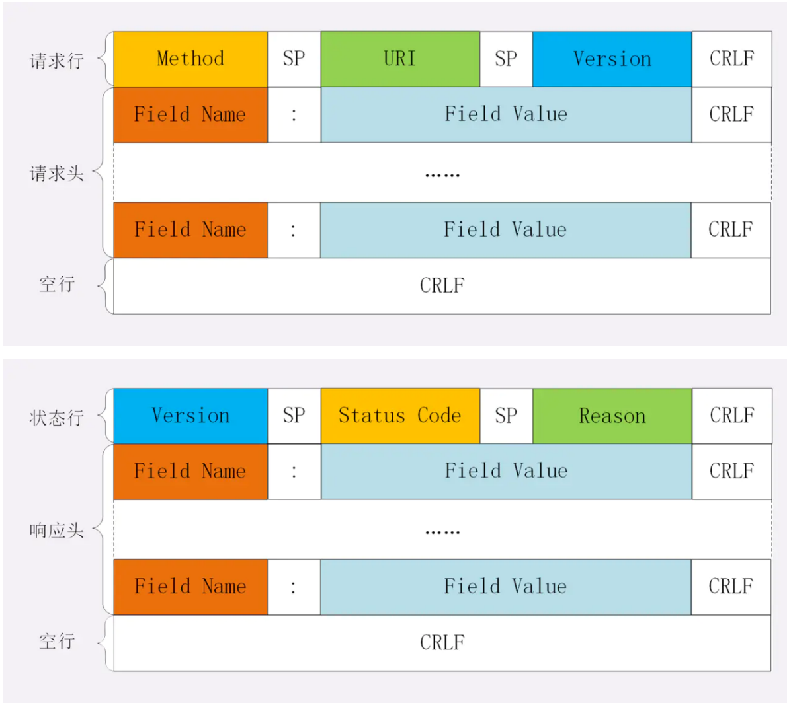
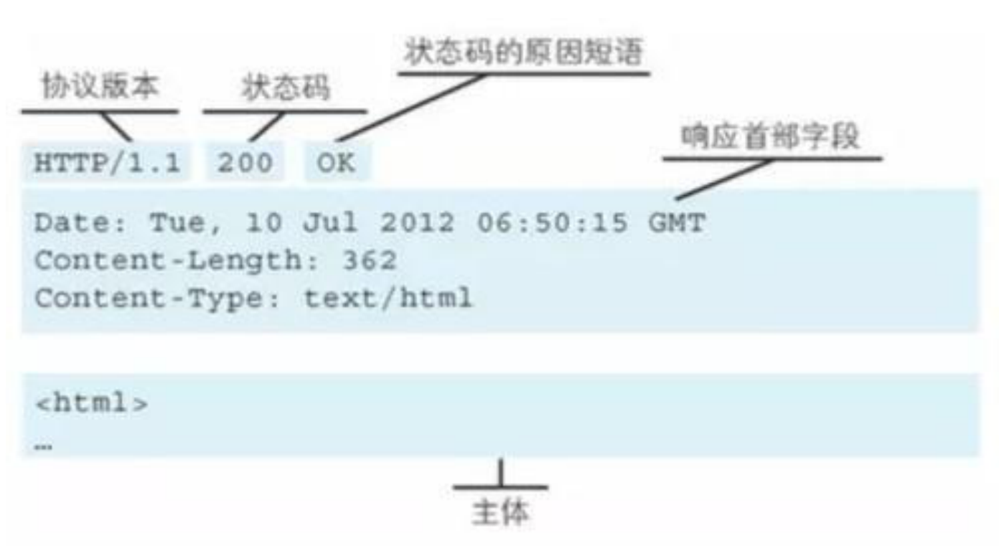

### Http知识点

#### 1. Http报文结构

组成结构：`请求行+ 请求头 + 空行 + body`或者`响应⾏、响应头、空⾏、响应体`



举个🌰请求报文和响应报文：




##### 起始行

对于请求报文，请求行类似于`GET /home HTTP/1.1`，分别为**方法 路径 协议版本**

对于相应报文，起始行类似于`HTTP/1.1 200 OK`，分别为**协议版本 状态码 原因**

在起始行中，每个部分之间都用空格隔开，最后接上转行

##### header

请求头由键值对组成，每⾏⼀对，键值之间⽤英⽂冒号`:`进行分隔。例如：

```
Content-Type: application/json
Host: www.abc.com
```

##### 空行

空行用来区分header和body，如果说在header中故意加一个空行，那么空行后面的内容都会被视为body

##### 请求体

请求体中放置 POST、PUT、PATCH 等请求方法所需要携带的数据。

通信大概是这个模式：


#### 2. HTTP的请求方法

|  方法   | 功能                                                         |
| :-----: | ------------------------------------------------------------ |
|   GET   | 通常⽤于请求服务器发送/请求某些资源（不要被字面意思欺骗了，可获取也可发送） |
|  POST   | 发送数据给服务器（可发可获取）                               |
|  HEAD   | 请求资源的头部信息, 并且这些头部与 HTTP GET ⽅法请求时返回的⼀致。<br />该请求⽅法的⼀个使⽤场景是在下载⼀个⼤⽂件前先获取其⼤⼩再决定是否要下载, 以此可以节约带宽资源 |
|   PUT   | ⽤于全量修改⽬标资源 (看接口, 也可以用于添加)                |
| DELETE  | ⽤于删除指定的资源                                           |
| OPTIONS | ⽤于获取⽬的资源所⽀持的通信选项 (跨域请求前, 预检请求, 判断目标是否安全) |
|  TRACE  | 追踪请求-响应的传输路径 用于诊断和判断                       |
| CONNECT | HTTP/1.1协议中预留给能够将连接改为管道⽅式的代理服务器<br />(把服务器作为跳板，让服务器代替用户去访问其它网页, 之后把数据原原本本的返回给用户) |
|  PATCH  | ⽤于对资源进⾏部分修改                                       |

#### 3. GET 和 POST的区别

|                  | GET方法                                                      | POST方法                                                     |
| ---------------- | ------------------------------------------------------------ | ------------------------------------------------------------ |
| **数据传输⽅式** | 通过URL传输数据 (地址栏拼接参数)                             | 通过请求体传输                                               |
| **数据安全**     | 数据暴露在URL中，可通过浏览历史记录、缓存等很容易查到数据信息 <br />get请求会被浏览器主动缓存下来，留下历史记录，而post不会 | 数据因为在请求主体内，<br />所以有⼀定的安全性保证           |
| **数据类型**     | 只允许 ASCII 字符                                            | ⽆限制                                                       |
| **GET⽆害**      | 刷新、后退等浏览器操作是⽆害的                               | 可能会引起重复提交表单                                       |
| **功能特性**     | 安全且幂等（这⾥的安全是指只读特性，就是使⽤这个⽅法不会引起服务器状态变化。<br />**幂等的概念是指同⼀个请求⽅法执⾏多次和仅执⾏⼀次的效果完全相同）** | ⾮安全(会引起服务器端的变化)、**⾮幂等**                     |
| **TCP的角度**    | GET会把请求报文一次性发出去                                  | 把数据分两个 TCP 数据包，先发 header 部分，<br />如果服务器响应 100(continue)， 然后发 body 部分。<br />(但是火狐浏览器的 POST 请求只发一个 TCP 包) |

#### 4. HTTP状态码

RFC 规定 HTTP 的状态码为三位数，被分为五类: 

```
1xx: 表示目前是协议处理的中间状态，还需要后续操作。 
2xx: 表示成功状态。 
3xx: 重定向状态，资源位置发生变动，需要重新请求。 
4xx: 请求报文有误。 
5xx: 服务器端发生错误
```

**1xx :**

| 状态码 | 原因短语            | 说明                                                         |
| ------ | ------------------- | ------------------------------------------------------------ |
| 101    | Switching Protocols | 在 HTTP 升级为 WebSocket 的时候，如果服务器同意变更，就会发送状态 码 101。 |

**成功（2XX）**

| 状态码 | 原因短语        | 说明                                                         |
| ------ | --------------- | ------------------------------------------------------------ |
| 200    | OK              | 表示从客户端发来的请求在服务器端被正确处理，通常在响应体中放有数据。 |
| 201    | Created         | 请求已经被实现，⽽且有⼀个新的资源已经依据请求的需要⽽建⽴<br />通常是在POST请求，或是某些PUT请求之后创建了内容, 进行的返回的响应 |
| 202    | Accepted        | 请求服务器已接受，但是尚未处理，不保证完成请求<br />适合异步任务或者说需要处理时间比较长的请求，避免HTTP连接一直占用 |
| 204    | No content      | 表示请求成功，但响应报⽂不含实体的主体部分                   |
| 206    | Partial Content | 进⾏的是范围请求, 表示服务器已经成功处理了部分 GET 请求<br />响应头中会包含获取的内容范围 (常用于分段下载) |

**重定向（3XX）**

| 状态码  | 原因短语           | 说明                                                         |
| ------- | ------------------ | ------------------------------------------------------------ |
| 301     | Moved Permanently  | 永久性重定向，表示资源已被分配了新的 URL<br />比如，我们访问 **http**://www.baidu.com 会跳转到 **https**://www.baidu.com |
| 302     | Found              | 临时性重定向，表示资源临时被分配了新的 URL, 支持搜索引擎优化<br />首页, 个人中心, 遇到了需要登录才能操作的内容, 重定向 到 登录页 |
| 303     | See Other          | 对于POST请求，它表示请求已经被处理，客户端可以接着使用GET方法去请求Location里的URI。 |
| **304** | **Not Modified**   | **自从上次请求后，请求的网页内容未修改过。<br />服务器返回此响应时，不会返回网页内容。(协商缓存)** |
| 307     | Temporary Redirect | 对于POST请求，表示请求还没有被处理，客户端应该向Location里的URI重新发起POST请求。<br />不对请求做额外处理, 正常发送请求, 请求location中的url地址 |

301 浏览器默 认会做缓存优化，在第二次访问的时候自动访问重定向的那个地址。 302浏览器并不会做缓存优化。

**客户端错误（4XX）**

| 状态码  | 原因短语                        | 说明                                        |
| ------- | ------------------------------- | ------------------------------------------- |
| **400** | **Bad Request**                 | **请求报⽂存在语法错误(（传参格式不正确）** |
| 401     | UnAuthorized                    | 权限认证未通过(没有权限)                    |
| 403     | Forbidden                       | 表示对请求资源的访问被服务器拒绝            |
| 404     | Not Found                       | 表示在服务器上没有找到请求的资源            |
| 408     | Request Timeout                 | 客户端请求超时                              |
| 409     | Confict                         | 请求的资源可能引起冲突                      |
| 413     | Request Entity Too Large        | 请求体的数据过大                            |
| 414     | Request-URI Too Long            | 请求行里的 URI 太大                         |
| 429     | Too Many Request                | 客户端发送的请求过多                        |
| 431     | Request Header Fields Too Large | 请求头的字段内容太大                        |

**服务端错误（5XX）**

| 状态码 | 原因短语                   | 说明                                                         |
| ------ | -------------------------- | ------------------------------------------------------------ |
| 500    | Internal Sever Error       | 表示服务器端在执⾏请求时发⽣了错误                           |
| 501    | Not Implemented            | 请求超出服务器能⼒范围，例如服务器不⽀持当前请求所需要的某个功能，<br />或者请求是服务器不⽀持的某个⽅法 |
| 503    | Service Unavailable        | 表明服务器暂时处于超负载或正在停机维护，⽆法处理请求         |
| 505    | Http Version Not Supported | 服务器不⽀持，或者拒绝⽀持在请求中使⽤的 HTTP 版本           |

#### 5. HTTP的特点

1. 语义自由：只规定了基本格式，比如空格分割，换行分隔字段等
2. 传输形式多样：不仅仅可以传输文本，还可以传输图片、视频、音频等等
3. 请求-应答的模式：一发一收，有来有回
4. 无状态：通信过程的上下文都是独立且无关的，默认是不保留状态信息的，这个无状态在长连接中会传输大量重读的信息，就会造成资源浪费，但是如果只是为了获取一些数据，而不需要上下文信息的时候就反而可以减小网络开销
5. 明文传输：报文（主要是头部）用的是文本形式，而不是二进制，方便调试，但是也容易暴露信息，一旦被黑可获取就造成信息的泄露。比如WIFI陷阱就是用http明文传输的缺点，诱导连上热点然后抓用户流量获取信息。
6. http是基于TCP链接的，当开启长连接的时候，共用一个TCP链接，一个时间只能处理一个请求，当有请求消耗时间过长，请求就很容易处于阻塞状态，这就是队头阻塞问题

#### 6. URI

URI, 全称为(Uniform Resource Identifier), 也就是统一资源标识符，它的作用很简单，就是区分互联网 上不同的资源。 但是，它并不是我们常说的网址 , 网址指的是 URL , 实际上 URI 包含了 URN 和 URL 两个部分，由于 URL 过于普及，就默认将 URI 视为 URL


scheme 表示协议名，比如 http , https , file 等等。后面必须和 :// 连在一起。 

user:passwd@ 表示登录主机时的用户信息，不过很不安全，不推荐使用，也不常用。

host:port表示主机名和端口。 path表示请求路径，标记资源所在位置。 

query表示查询参数，为 key=val 这种形式，多个键值对之间用 & 隔开。 

fragment表示 URI 所定位的资源内的一个锚点，浏览器可以根据这个锚点跳转到对应的位置。

举个🌰: 这个 URI 中，

```
https://www.baidu.com/s?wd=HTTP&rsv_spt=1
```

 https 即 scheme 部分， www.baidu.com 为 host:port 部分（注意，http 和 https 的默 认端口分别为80、443）,  /s 为 path 部分，而 wd=HTTP&rsv_spt=1 就是 query 部分。

#### 7. Accept 系列字段

对于 Accept 系列字段的介绍分为四个部分: 数据格式、压缩方式、支持语言和字符集。

##### 数据格式

HTTP支持很多数据格式，但是这么多数据格式，客户端是怎么知道是什么格式的呢？

首先先了解一下**MIME(Multipurpose Internet Mail Extensions, 多用途 互联网邮件扩展)。**最先使用在邮件系统中，使邮件可以发任意类型的数据，这对HTTP也是通用的。HTTP从**MIME type**中取了一部分来标记报文body部分的数据类型，发送端用`Content-Type`来表示数据类型，接收端用`Accept`字段来表示想收到的特定类型的数据。

具体而言，这两个字段的取值可以分为下面几类: text：

```
text: text/html, text/plain, text/css 等 
image: image/gif, image/jpeg, image/png 等 
audio/video: audio/mpeg, video/mp4 等 
application: application/json, application/javascript, application/pdf, application/octet-stream
```

##### 压缩方式

以上的那些数据都是会进行编码压缩的，`Content-Encoding`表示了发送端采取什么方式压缩，`Accept-Encoding`表示了接收端接收什么样的压缩方式，这个字段主要有这几种：

> gzip: 当今最流行的压缩格式 
>
> deflate: 另外一种著名的压缩格式 
>
> br: 一种专门为 HTTP 发明的压缩算法

##### 支持语言

在一些国际化的方案中，可以用来制定支持的语言，发送端用`Content-Language`，接收方用`Accept-Language`

```js
// 发送端
Content-Language: zh-CN, zh, en
// 接收端
Accept-Language: zh-CN, zh, en
```

##### 字符集

在接收端，可以用`Accept-Charset`指定可以接收的字符集，而在发送端，这个字段是被放在了`Content-Type`中，以charset属性来制定

```js
// 发送端
Content-Type: text/html; charset=utf-8
// 接收端
Accept-Charset: charset=utf-8
```

##### 总结


#### 8. 定长和不定长的数据，HTTP是如何传输的？

##### 定长包体

对于定长的包体，发送端在传输的时候会带上`Content-Length`来指明长度，如果长度正确，则浏览器中显示相应的内容，如果传输的内容长度大于length，那么超出的部分就会被截断，如果内容长度小于length，那么浏览器可能就无法显示了，传输失败。

##### 不定长包体

头部字段`Transfer-Encoding: chunked`表示分块传输数据

这个字段会自动产生两个效果：1. content-length会被忽略，2. 基于长链接会推送动态内容

#### 9. HTTP1.X的Keep-alive

作用：使得客户端到服务端的连接持续有效（长连接），对服务器后续的请求不需要重新建立连接

早期的HTTP/1.0每一次请求都要建立连接，这个过程会消耗资源和时间，为了减少资源消耗，缩短响应时间，就需要复用连接，也就是在请求头中加入`Connection: keep-alive`告诉服务器，这个请求响应结束后不要关闭连接，后面还要继续交流。

**keep-alive 的优点** (复用连接)

- 较少的 CPU 和内存的占⽤（因为要打开的连接数变少了, 复用了连接） 
- 减少了后续请求的延迟（⽆需再进⾏握⼿） 
- ...

缺点: 因为在处理的暂停期间，本来可以释放的资源仍旧被占用。请求已经都结束了, 但是还一直连接着也不合适

解决：Keep-Alive: timeout=5, max=100

- timeout：过期时间5秒（对应httpd.conf里的参数是：KeepAliveTimeout），

- max是最多一百次请求，强制断掉连接。

  就是在timeout时间内又有新的连接过来，同时max会自动减1，直到为0，强制断掉。

#### 10. HTTP处理大的文件传输

对于几百M甚至更大的文件来说，如果一下都传输，会造成很长的等待时间，影响用户体验，对于这种情况，HTTP可以用范围请求来允许客户端仅仅请求资源的一部分。前提是服务器支持**范围请求**，如果要用这种功能，如何知道呢？服务器这边的响应头里面有这样一个字段

```js
Accept-Ranges: none //告知客户端这里是支持范围请求的
```

**Range字段拆解**

客户端需要请求哪一部分，可以用`Range`这个请求头字段确定，格式为`bytes:x-y`

> 0-499表示从开始到第 499 个字节。 
>
> 500- 表示从第 500 字节到文件终点。 
>
> -100表示文件的最后100个字节。

服务器收到请求后，先验证范围对不对，如果越界就返回416，否则就读取相应的范围并返回206，服务器收需要添加`Content-Range`字段，这个跟请求头有点差异，分单段数据和多段数据

```js
// 单段数据
Range: bytes=0-9
// 多段数据
Range: bytes=0-9, 30-39
```

**单段数据**

对于单段数据的请求，返回的响应如下:

```js
HTTP/1.1 206 Partial Content
Content-Length: 10
Accept-Ranges: bytes
Content-Range: bytes 0-9/100   //0-9 表示请求的返回，100 表示资源的总大小

i am xxxxx
```

**多段数据**

```js
HTTP/1.1 206 Partial Content
Content-Type: multipart/byteranges; boundary=00000010101
Content-Length: 189
Connection: keep-alive
Accept-Ranges: bytes

--00000010101
Content-Type: text/plain
Content-Range: bytes 0-9/96

i am xxxxx
--00000010101
Content-Type: text/plain
Content-Range: bytes 20-29/96

eex jspy e
--00000010101--
```

这里的Content-Type字段后面的两个属性表示：一定是多段请求的数据，响应体中分隔符是00000010101。因此，在多段数据请求的响应体中，一定会用制定分隔符分开，而且在最后的分隔符末尾添加上`--`表示结束。

#### 11. HTTP中如何处理表单数据的提交

在http中，主要有两种提交表单的方式，`Content-Type`的取值有两种application/x-www-form-urlencoded， multipart/form-data。提交表单一般用POST，因此默认讲提交的数据放在请求体中。

**application/x-www-form-urlencoded**

这种方式的表单内容会被编码成以&分割的键值对，字符用URL编码的方式编码

> // 转换过程: {a: 1, b: 2} -> a=1&b=2 -> 如下(最终形式) "a%3D1%26b%3D2"

**multipart/form-data**

这种方式，请求头中`Content-Type`字段里会包含boundary，看10的多段数据请求，而且boundary的值由浏览器默认指定

> Content-Type: multipart/form-data;boundary=---- WebkitFormBoundaryRRJKeWfHPGrS4LKe 。

数据被分成多个部分，每两个部分之间用分隔符分隔，每个部分都有http头部描述子包体，最后分隔符加上`--`

```js
Content-Disposition: form-data;name="data1";
Content-Type: text/plain
data1
----WebkitFormBoundaryRRJKeWfHPGrS4LKe
Content-Disposition: form-data;name="data2";
Content-Type: text/plain
data2
----WebkitFormBoundaryRRJKeWfHPGrS4LKe--
```

##### 小结

**multipart/form-data**最大的特点就是每一个表单元素都是独立的资源描述，在抓包过程中如果没有看到boundary，但是元素确实是被分开了，是因为浏览器和http封装了这个操作。在实际应用中，图片一般都用**multipart/form-data**而不是用**application/x-www-form-urlencoded**，因为没必要做URL编码，会占用更多空间

#### 12. HTTP1.1队头阻塞

##### 什么是HTTP队头阻塞

HTTP传输是请求应答模式，报文必须是一发一收，但是这里面的人物是被放在一个任务队列里串行执行的，一旦队首执行处理太慢，就会阻塞后面的请求处理。

##### 并发连接

一个域名可以分配多个长连接，相当于增加了任务队列的个数，在RFC2616规定客户端最多病发两个，但是现在的浏览器中上限有很多chrome是6个。

##### 域名分片

一个域名可以分多个长连接，那么可以多分几个域名，比如 content1.sanyuan.com 、content2.sanyuan.com等

这样一个 sanyuan.com 域名下可以分出非常多的二级域名，而它们都指向同样的一台服务器，能够并发 的长连接数更多了，事实上也更好地解决了队头阻塞的问题。

#### 13. COOKIE

因为http的请求每次都是独立的，默认是不保留状态的，如果需要保存一些状态，这个时候就引入了cookie。cookie本质上是浏览器里存储的一个小文件，内部是用键值对存储的。向同一个域名下发送请求，都会携带相同的cookie，服务器拿到cookie后进行解析，这样就可以拿到客户端的状态了。而服务端可以通过响应头中的`Set-Cookie` 字段来对客户端写入 Cookie 。举例如下:

```js
// 请求头
Cookie: a=xxx;b=xxx // 响应头 
Set-Cookie: a=xxx 
Set-Cookie: b=xxx
```

##### cookie的属性

cookie的有效期用**Expires**和**Max- Age**来设定，前者表示过期的时间，后者表示用的时间间隔，单位是s，从浏览器收到报文开始计算，如果过期了，那么这个cookie就会被删除，不会发给服务端。

cookie的两个属性**Domain**和**path**, 给 **Cookie** 绑定了域名和路径，在发送请求前发现域名或者路径和这两个属性不匹配，那么就不会带上cookie。其中`/`表示域名下的任意路径都可以用cookie。

如果带上**Security** ，说明只能通过 HTTPS 传输 cookie，如果带上`HttpOnly`就只能通过http传输，不能用js访问，可以预防XSS攻击

相应的，对于 CSRF 攻击的预防，也有 `SameSite` 属性。

`SameSite` 可以设置为三个值， `Strict` 、 `Lax` 和 `None` 。
 **a.** 在 Strict 模式下，浏览器完全禁止第三方请求携带Cookie。比如请求 sanyuan.com 网站只能在sanyuan.com 域名当中请求才能携带 Cookie，在其他网站请求都不能。
 **b.** 在 Lax 模式，就宽松一点了，但是只能在 get 方法提交表单或者 a 标签发送 get 请求的情况下可以携带 Cookie，其他情况均不能。
 **c.** 在 None 模式下，也就是默认模式，请求会自动携带上 Cookie。

##### cookie的缺点

1. 容量小，只有4KB
2. 性能缺陷，紧跟域名，不管这个域名下的某个地址要不要cookie，请求都会带上完整的cookie，如果参数多的话会造成性能浪费，但是可以用domain和path指定的作用域来解决这个问题
3. 安全问题，cookie是文本的形式传输的，被非法获取的话，进行篡改是非常危险的。在HttpOnly为false的情况下cookie是可以用js来获取的

#### 14. Http缓存

web服务缓存大致可以分为：数据库缓存，服务器缓存（代理缓存，CDN服务器缓存），浏览器缓存

浏览器缓存包含：http缓存，indexDB，cookie，localstorage。（浏览器缓存主要是HTTP协议定义的缓存机制）

在具体了解 HTTP 缓存之前先来明确几个术语：

- 缓存命中率：从缓存中得到数据的请求数  与 所有请求数的比率。理想状态是越高越好。(看所有的请求中, 多少从缓存中读的)

- 过期内容：超过设置的有效时间，被标记为“陈旧”的内容。

- 验证：验证缓存中的过期内容是否仍然有效，验证通过的话刷新过期时间。

- 失效：失效就是把内容从缓存中移除。

**HTTP缓存**:  (优化页面加载的效率, 如果没有缓存策略, 每次重新加载页面, 会非常慢!)

- **强缓存**
- **协商缓存**

浏览器加载一个页面的主要流程如下：

1. 浏览器先根据这个资源的**http头部信息**判断是否命中强缓存，如果命中则直接夹在浏览器中的缓存，并不发送请求到服务器（强缓存）
2. 如果没有命中强缓存，浏览器则将资源加载的请求发到服务器，服务器来判断本地缓存是否失效，如果服务器判定没有失效，那么就返回状态码304并不会返回资源信息，浏览器继续从缓存里读取信息（协商缓存），如果服务器判定失效了，那么就会返回状态码200和完整的资源信息，浏览器加载新的资源信息并进行缓存

##### 强缓存

命中强缓存时，浏览器并不会将请求发送给服务器


强缓存是利用，http报文header里的cache-control（优先级更高）或者expires来控制的

Expires: 指定一个具体时间(2050年11月23日 16:00：01), 到了这个时间了, 缓存过期了, 在时间内, 都是有效的, 可以直接读

Cache-Control : 指定一个过期时间 (315360000s), 这个资源你加载到后, 可以用 315360000s

**Expires**是web服务器响应头的字段，是服务器的具体时间，但是这有一个问题，就是失效的时间是绝对时间，当服务器和客户端的时间偏差很大的时候，就很混乱了，而**Cache-Control **就比较灵活了，他表示的是相对时间，表示资源到期的时间是 xxxx秒，从响应报文到达客户端的时刻开始计秒，所以客户端和服务器的时间有偏差也不会出现问题。

**Cache-Control**有很多字段，主要有这么几个：

1. **max-age** 指定一个时间长度，在这个时间段内缓存是有效的，单位是s。第一次访问这个资源的时候，服务器会返回这个字段或者expires
2. **no-cache** 强制所有缓存了该响应的用户，在使用已缓存的数据前，发送带验证的请求到服务器, 问服务器是否可以读缓存。
3. **no-store** 禁止缓存，每次请求都要向服务器重新获取数据。

##### 协商缓存

若未命中强缓存(强缓存过期了)，则浏览器会将请求发送至服务器。服务器根据http头信息中的`Last-Modify/If-Modify-Since`或`Etag/If-None-Match`来判断是否命中协商缓存。如果命中，则http返回码为304 (你本地之前加载的资源是有效的)，浏览器从缓存中加载资源。

**Last-Modify/If-Modify-Since**

浏览器第一次请求一个资源的时候，服务器返回的header中会加上**Last-Modify**表示该资源最后修改的时间（如上图），当浏览器再次请求该资源（协商请求）时，发送的请求头中会包含If-Modify-Since，**该值为缓存之前返回的Last-Modify**。服务器收到If-Modify-Since后，根据实际服务器的资源的最后修改时间, 进行判断是否命中缓存。如果命中缓存，则返回 **http304**，并且不会返回资源内容，并且不会返回Last-Modify。


注意他们对比的是服务器的修改时间，所以客户端与服务器之间的时间差不会有影响，但是如果资源在1s内被修改了多次，这个时候就无法准确判断资源是否更新了，因此就出现了**ETag/If-None-Match**

**ETag/If-None-Match**

Etag/If-None-Match返回的是一个校验码。Etag可以保证每一个资源都是唯一的，资源只要变化了Etag就会变。服务器根据浏览器发过来的If-None-Match来判断是否命中缓存。


ETag生成靠以下几种因子

1. 文件的i-node编号，是Linux/Unix用来识别文件的编号。 

2. 文件最后修改时间

3. 文件大小

   ...

**生成Etag的时候，可以使用其中一种或几种因子，使用抗碰撞散列函数来生成。生成一个标记文件的唯一值**

**Note**：Etag的出现主要是为了解决几个Last-Modified比较难解决的问题

1. Last-Modified标注的最后修改只能精确到秒级，如果某些文件在1秒钟以内，被修改多次的话，它将不能准确标注文件的修改时间
2. 有可能存在服务器没有准确获取文件修改时间，或者与代理服务器时间不一致等情形

Etag是服务器自动生成或者由开发者生成的对应资源在服务器端的唯一标识符，能够更加 **准确的控制缓存。**不会仅仅只根据最后的修改时间判断是否进行使用缓存。Last-Modified与ETag是可以一起使用的，服务器会优先验证ETag，一致的情况下，才会继续比对Last-Modified，

最后才决定是否返回304。

##### 小结:

- **强缓存:** 检查过期时间, 判断缓存是否失效,  如果不失效, 直接用, 不发请求 ，大大的减少了服务器的请求次数, 在过期时间内, 直接从客户端内存中读 

- **协商缓存**: 强缓存命中失效了, 超过过期时间了, 拿着标识(最后的修改时间,  唯一标识etag), 去问服务器, 是否真的过期了，如果验证通过,  服务器会直接响应 304, 且不会返回资源

不太会变的资源 => 图片, 非常的适合应用强缓存 (过期时间也可以设置的很长)；如果是一些很可能会变的资源, 也希望能缓存 => 过期时间设置短一些,  一旦过期, 协商缓存，实际工作两者相互配合。

##### 整体请求缓存流程

**浏览器第一次请求**


**浏览器第二次请求**


#### 15.HTTP代理

http是问答模式，一般是客户端请求，服务端响应，代理是作为中间人，响应客户端并作为源服务器的客户端。

代理服务器主要的功能有：

1)**负载均衡**。客户端的请求只会先到达代理服务器，后面到底有多少源服务器，IP 都是多少，客户端 是不知道的。因此，这个代理服务器可以拿到这个请求之后，可以通过特定的算法分发给不同的源服务 器，让各台源服务器的负载尽量平均。当然，这样的算法有很多，包括**随机算法**、**轮询**、**一致性hash**、 **LRU** (最近最少使用) 等等。

2)**保障安全**。利用**心跳**机制监控后台的服务器，一旦发现故障机就将其踢出集群。并且对于上下行的数据进行过滤，对非法 IP 限流，这些都是代理服务器的工作。

3)**缓存代理**。将内容缓存到代理服务器，使得客户端可以直接从代理服务器获得而不用到源服务器那里。

**相应字段**：

**Via**

通过 `Via `字段来记录。举个例子，现在中间有两台代理服务器，在客户端发送请求后会经历这样一个过程:

> 客户端 -> 代理1 -> 代理2 -> 源服务器

在源服务器收到请求后，会在 请求头 拿到这个字段:

```js
Via: proxy_server1, proxy_server2
```

而源服务器响应时，最终在客户端会拿到这样的 响应头 :

```js
Via: proxy_server2, proxy_server1
```

可以看到， `Via` 中代理的顺序即为在 HTTP 传输中报文传达的顺序。

**X-Forwarded-For**

字面意思就是为谁转发 , 它记录的是**请求方**的 IP 地址(注意，和 Via 区分开， X-Forwarded-For 记录的是 请求方这一个IP。

**X-Real-IP**

获取用户真实 IP 的字段，不管中间经过多少代理，这个字段始终记录最初的客户端的IP。 相应的，还有 X-Forwarded-Host 和 X-Forwarded-Proto，分别记录**客户端**(不包括代理)的 域名和协议名。

**X-Forwarded-For**产生的问题

前面可以看到， X-Forwarded-For 这个字段记录的是请求方的 IP，这意味着每经过一个不同的代理，这个字段的名字都要变，从 客户端 到 代理1 ，这个字段是客户端的 IP，从 代理1 到 代理2 ，这个字段就变为了代理1的 IP。

但是这会产生两个问题:
 1)意味着代理必须解析 HTTP 请求头，然后修改，比直接转发数据性能下降。
 2)在 HTTPS 通信加密的过程中，原始报文是不允许修改的。

由此产生了 `代理协议` ，一般使用明文版本，只需要在 HTTP 请求行上面加上这样格式的文本即可:

```js
// PROXY + TCP4/TCP6 + 请求方地址 + 接收方地址 + 请求端口 + 接收端口 
PROXY TCP4 0.0.0.1 0.0.0.2 1111 2222
GET / HTTP/1.1
...
```

#### 16.为什么产生代理缓存

服务器也是有缓存的，比如Redis，Memcache，但是对于http缓存来说，如果每次客户端缓存失败就去源服务器获取，那么源服务器的压力也会很大，因此就出现了代理缓存。顾名思义，就是让代理服务器接管一部分服务端的http缓存，客户端缓存过期后可以**就近**去代理缓存中获取资源，如果代理缓存也过期了，那么再去请求源服务器，降低源服务器的压力。

代理缓存的控制主要有两个部分：源服务器的控制 和 客户端的控制

##### 16.1 源服务器的缓存控制

1. **private** **和** **public**

   在源服务器的响应头中，加上`Cache-Control`这个字段进行缓存控制，这个字段对应的value中可以加入`private`或者`public`，前者表示不允许代理缓存，后者表示可以允许代理缓存。对于一些非常私密的数据，一般都是设置为private，因为一旦别人直接从代理中拿到这些数据就会有信息泄露的危险，所以不能设为public

2. **proxy-revalidate**

   `must-revalidate` 的意思是**客户端**缓存过期就去源服务器获取，而 `proxy-revalidate` 则表示**代理服务器**的缓存过期后到源服务器获取。

3. **s-maxage**

   `s` 是`share`的意思，表示，先定了缓存在代理服务器中可以存放多久

举个🌰：

```js
Cache-Control: public, max-age=1000, s-maxage=2000
```

这个表示源服务器说，我的响应允许代理服务器进行缓存，客户端缓存过期了可以去代理中拿，资源在客户端缓存的时间为1000s，在代理服务器中缓存的时间为2000s

##### 16.2 客户端的缓存控制

1. **max-stale** **和** **min-fresh**

   在客户端的请求头中，可以加入这两个字段，来对代理服务器上的缓存进行**宽容**和**限制**操作。比如:

   ```js
   max-stale: 5 //表示客户端到代理去取缓存的时候，即使代理缓存过期了也没事，只要过期在5s内还是可以取的
   min-fresh: 5 //表示客户需要新鲜度，一定要在缓存到期前5s内获取才能拿到，否则拿不到，即使刚好到期，代理也不会返回缓存
   ```

2. **only-if-cached**

   这个字段加上后表示客户端只会接受代理缓存，而不会接受源服务器的响应。如果代理缓存无效，则直接返回 `504(Gateway Timeout) `。

#### 17. 跨域

##### 什么是跨域？

在第六个知识点中，我们知道URI的组成。浏览器遵循同源策略，即协议，域名和端口号都要相同。只要三者有一个不一样那就产生跨域。非同源的话，就不能读取和修改对方的DOM，不能读取COOKIE，indexDB，LocalStorage，限制XHRHttpRequest。

跨域请求的响应一般会被浏览器拦截，也就是说，其实响应是成功到客户端了，但是被浏览器拦截了。服务端在处理完数据后，将响应返回，主进程检查到跨域而且没有cors响应头，就将响应体都丢掉，不发送给渲染进程，就达到了拦截数据的目的。

##### 跨域的几种方案：

**CORS**（跨域资源共享），需要浏览器和服务器共同支持，非IE和IE10以上支持CORS。

> 请求分为简单请求和非简单请求
>
> 简单请求：请求方法为 GET、POST 或者 HEAD，请求头的取值范围: Accept、Accept-Language、Content-Language、Content-Type(只限于三个 值 application/x-www-form-urlencoded 、 multipart/form-data 、 text/plain )
>
> 其他都是非简单请求

对于**简单请求**，浏览器自动在请求头中添加了`Origin`字段，说明请求来自于哪个源。服务器拿到请求后，会添加`Access-Control-Allow-Origin`，如果Origin不在这个字段的范围中，那么浏览器就拦截。**Access-Control-Allow-Credentials**。这个字段是一个布尔值，表示是否允许发送 Cookie，对于跨域 请求，浏览器对这个字段默认值设为 false，而如果需要拿到浏览器的 Cookie，需要添加这个响应头并设为 true , 前端也需要设置 withCredentials 属性:

```js
let xhr = new XMLHttpRequest();
xhr.withCredentials = true;
```

**Access-Control-Expose-Headers**。这个字段是给 XMLHttpRequest 对象赋能，让它不仅可以拿到基本的 6 个响应头字段(包括 Cache-Control 、 Content-Language 、 Content-Type 、 Expires 、Last-Modified 和 Pragma ), 还能拿到这个字段声明的**响应头字段**。比如这样设置:

```js
Access-Control-Expose-Headers: aaa
```

对于**非简单请求**， 首先会发送**预检请求**，请求行和请求体如下：

```
OPTIONS / HTTP/1.1
Origin: 当前地址
Host: xxx.com
Access-Control-Request-Method: PUT 
Access-Control-Request-Headers: X-Custom-Header
```

预检请求的方法是 OPTIONS ，同时会加上 Origin 源地址和 Host 目标地址，这很简单。同时也会加上两 个关键的字段:

Access-Control-Request-Method, 列出 CORS 请求用到哪个HTTP方法 Access-Control-Request-Headers，指定 CORS 请求将要加上什么请求头

其对应的响应字段如下，响应字段分为两部分，一部分是**预检请求**的响应，一部分是对**CORS请求**的响应

```js
HTTP/1.1 200 OK
Access-Control-Allow-Origin: *
Access-Control-Allow-Methods: GET, POST, PUT
Access-Control-Allow-Headers: X-Custom-Header
Access-Control-Allow-Credentials: true
Access-Control-Max-Age: 1728000
Content-Type: text/html; charset=utf-8
Content-Encoding: gzip
Content-Length: 0
```

其中有这样几个关键的**响应头字段**:

- Access-Control-Allow-Origin: 表示可以允许请求的源，可以填具体的源名，也可以填 * 表示允许 任意源请求。
- Access-Control-Allow-Methods: 表示允许的请求方法列表。 Access-Control-Allow-Credentials: 简单请求中已经介绍。
- Access-Control-Allow-Headers: 表示允许发送的请求头字段
- Access-Control-Max-Age: 预检请求的有效期，在此期间，不用发出另外一条预检请求。

在预检请求的响应返回后，如果请求不满足响应头的条件，则触发 XMLHttpRequest 的 onerror 方法， 当然后面真正的**CORS请求**也不会发出去了。

**CORS** **请求的响应**。绕了这么一大转，到了真正的 CORS 请求就容易多了，现在它和**简单请求**的情况是 一样的。浏览器自动加上 Origin 字段，服务端响应头返回**Access-Control-Allow-Origin**。可以参考以 上简单请求部分的内容。


**JSONP**

虽然 XMLHttpRequest 对象遵循同源政策，但是 script 标签不一样，它可以通过 src 填上目标地址从 而发出 GET 请求，实现跨域请求并拿到响应。这也就是 JSONP 的原理。和 CORS 相比，JSONP 最大的优势在于兼容性好，IE 低版本不能使用 CORS 但可以使用 JSONP，缺点也 很明显，请求方法单一，只支持 GET 请求。


**Nginx**

Nginx 是一种高性能的 反向代理 服务器，可以用来轻松解决跨域问题。


正向代理帮客户端访问客户端访问不到的服务器，然后将结果返回给客户端，

反向代理拿到客户端的请求，将请求转发给其他的服务器，主要的场景是维持服务器集群的**负载均衡**，

换句话说，反向代理帮**其它的服务器**拿到请求，然后选择一个合适的服务器，将请求转交给它。 因此，两者的区别就很明显了，正向代理服务器是帮**客户端**做事情，而反向代理服务器是帮其它的服务器做事情。

那 Nginx 是如何来解决跨域的呢?

比如说现在客户端的域名为**client.com**，服务器的域名为**server.com**，客户端向服务器发送 Ajax 请 求，当然会跨域了，那这个时候让 Nginx 登场了，通过下面这个配置:

```js
server {
  listen  80;
  server_name  client.com;
  location /api {
    proxy_pass server.com;
  }
}
```

Nginx 相当于起了一个跳板机，这个跳板机的域名也是 client.com ，让客户端首先访问 client.com/api ，这当然没有跨域，然后 Nginx 服务器作为反向代理，将请求转发给 server.com ，

#### 18. RSA握手

传统TLS1.2握手流程如下


**step 1: Client Hello**

首先，浏览器发送 client_random、TLS版本、加密套件列表。

client_random 是什么?用来最终 secret 的一个参数。 

加密套件列表是什么?加密套件列表一般张这样:

> TLS_ECDHE_WITH_AES_128_GCM_SHA256

意思是 TLS 握手过程中，使用 ECDHE算法生成 pre_random，128位的 AES 算法进行 对称加密，在对称加密的过程中使用主流的 GCM 分组模式，因为对称加密中很重要的一个问题就是如何 分组。最后一个是哈希摘要算法，采用 SHA256 算法。

其中值得解释一下的是这个哈希摘要算法，试想一个这样的场景，服务端现在给客户端发消息来了，客 户端并不知道此时的消息到底是服务端发的，还是中间人伪造的消息呢?现在引入这个哈希摘要算法， 将服务端的证书信息通过**这个算法**生成一个摘要(可以理解为 比较短的字符串 )，用来**标识**这个服务端的身 份，用私钥加密后把**加密后的标识**和**自己的公钥**传给客户端。客户端拿到**这个公钥**来解密，生成另外一 份摘要。两个摘要进行对比，如果相同则能确认服务端的身份。这也就是所谓**数字签名**的原理。其中除 了哈希算法，最重要的过程是**私钥加密，公钥解密**。

**step 2: Server Hello**

可以看到服务器一口气给客户端回复了非常多的内容。
 server_random 也是最后生成 secret 的一个参数, 同时确认 TLS 版本、需要使用的加密套件和自己的证书，这都不难理解。那剩下的 server_params 是干嘛的呢? 我们先埋个伏笔，现在你只需要知道， server_random 到达了客户端。

**step 3: Client** **验证证书，生成secret**
客户端验证服务端传来的 证书 和 签名 是否通过，如果验证通过，则传递 client_params 这个参数给服

务器。

接着客户端通过 ECDHE 算法计算出 pre_random ，其中传入两个参数:**server_params**和 **client_params**。现在你应该清楚这个两个参数的作用了吧，由于 ECDHE 基于 椭圆曲线离散对数 ，这两 个参数也称作 椭圆曲线的公钥 。

客户端现在拥有了 client_random 、 server_random 和 pre_random ，接下来将这三个数通过一个伪 随机数函数来计算出最终的 secret 。

**step4: Server** **生成** **secret**

刚刚客户端不是传了 client_params 过来了吗?现在服务端开始用 ECDHE 算法生成 pre_random ，接着用和客户端同样的伪随机数函数生成最后的 secret 。

**注意事项**

TLS的过程基本上讲完了，但还有两点需要注意。
 **第一**、实际上 TLS 握手是一个**双向认证**的过程，从 step1 中可以看到，客户端有能力验证服务器的身份，那服务器能不能验证客户端的身份呢?
 当然是可以的。具体来说，在 step3 中，客户端传送 client_params ，实际上给服务器传一个验证消息，让服务器将相同的验证流程(哈希摘要 + 私钥加密 + 公钥解密)走一遍，确认客户端的身份。

**第二**、当客户端生成 secret 后，会给服务端发送一个收尾的消息，告诉服务器之后的都用对称加密， 对称加密的算法就用第一次约定的。服务器生成完 secret 也会向客户端发送一个收尾的消息，告诉客 户端以后就直接用对称加密来通信。

这个收尾的消息包括两部分，一部分是 ，意味着后面加密传输了，另一个是 Finished 消息，这个消息是对之前所有发送的数据做的**摘要**，对摘要进行加密，让对方验证一下。当双方都验证通过之后，握手才正式结束。后面的 HTTP 正式开始传输加密报文。

#### 19. HTTPS：

HTTP协议是网络通信的基石, 基于HTTP协议, 完成了很多的网页应用功能, 但是HTTP协议是明文传输数据的! 太不安全了!

HTTPS 是安全版的 HTTP。

HTTP 协议在传输数据时采用的是明⽂方式传递，因此，⼀些敏感信息的传输就变得很不安全。

而 HTTPS 就是为了解决 HTTP 的不安全⽽产⽣的。

#### 20. HTTPS如何保证安全

HTTPS 在传输数据的过程中会对数据进行加密处理，保证安全性。

那HTTPS采用的什么样的加密方式呢？我们来了解下一些加密的基本概念。

目前常见的加密算法可以分成三类，`对称加密算法`，`非对称加密算法` 和 `Hash算法`。

1. 对称加密算法: 相同密钥加密解密,  可逆的! 可以用于加密解密传输数据

   想使用对称加密算法, 一定要保证密钥不被泄漏  (且进行密钥的传输约定时, 一定要保证安全)

2. 非对称加密算法: 有两把钥匙, 公钥, 私钥,  可逆的, 可以用于 https 的初步交换密钥

3. Hash算法: 不可逆的,  根据一段内容, 生成一段唯一标识, 一般用于验证数据是否被修改!   (md5)

##### 对称加密

对称加密的特点是文件加密和解密使用相同的密钥，即加密密钥也可以用作解密密钥，这种方法在密码学中叫做对称加密算法，对称加密算法使用起来简单快捷，密钥较短，且破译困难，**通信的双⽅都使⽤同⼀个秘钥进⾏加密, 解密。**⽐如，两个人事先约定的暗号，就属于对称加密。 


对称加密的特点是：

- 优点:

  计算量小、加密速度快、加密效率高。

- 缺点: 

  **在数据传送前，发送方和接收方必须商定好秘钥，然后双方保存好秘钥。**

  **如果一方的秘钥被泄露，那么加密信息也就不安全了**

  最不安全的地方, 就在于第一开始, 互相约定密钥的时候!!! 传递密钥!

使用场景：本地数据加密、https通信、网络传输等

常见算法：AES、DES、3DES、DESX、Blowfish、IDEA、RC4、RC5、RC6  (全球公开, 通过了层层筛选, 层层检验)  没有被破解

全球有专门做算法设计的加密算法设计师, 但经过公开检验的算法才是安全的 (很多公开的算法, 虽然可以用撞库的方式破解, 但是尝试破解的成本会非常高 (甚至几百年))

##### 非对称加密

而加密和解密其实可以使用不同的规则，只要这两种规则之间存在某种对应关系即可，

这样就避免了直接传递之前的相同的密钥。这种新的加密模式被称为"非对称加密算法"。

通信的双方使用不同的秘钥进行加密解密，即秘钥对（私钥 + 公钥）。

特征: 私钥可以解密公钥加密的内容,  公钥可以解密私钥加密的内容


非对称加密的特点是：

- 优点：非对称加密与对称加密相比其安全性更好

- **缺点：加密和解密花费时间长、速度慢，只适合对少量数据进行加密。**

使用场景：https会话前期、CA数字证书、信息加密、登录认证等

常见算法：RSA、ECC（移动设备用）、Diffie-Hellman、El Gamal、DSA（数字签名用）

##### HTTPS采用的加密方案

结合了两种加密方式：将对称加密的密钥通过非对称加密的公钥进行加密发送出去，接收方用私钥揭秘得到对称加密的密钥，沟通时双方用对称加密密钥进行通话，HTTPS 目前所使用的 TLS或SSL协议,  就是目前采用的加密通道的规范协议 

它利用对称加密、(公私钥)非对称加密, 以及其密钥交换算法，可完成可信任的信息传输

1. 利用 非对称加密 加密传输 对称加密所约定的密钥  (保证了密钥传输的安全)
2. 后续, 利用对称加密, 有效便捷的进行数据传输!!

#### 21.数字证书

为了安全性, 一般还需要签发数字证书! 客户端 和 服务器端要初步互通消息时,  客户端发送请求可以拿到公开的公钥信息

进而进行非对称加密, 使用公钥, 加密`对称加密密钥`, 传递给服务器, 后续通信都使用对称加密! 


**问题是: 初步互通消息时, 如果请求拿到的公钥信息, 就是假的, 或者不安全的! 那么后续的所有操作, 都将是不安全的!**

如何保证公钥的安全性呢??  说白了, 需要证明公钥是安全可靠的!!! 要证明网站是安全可靠的!!!

所以, 就需要有数字证书(CA证书),  一般是CA机构(互联网的机构,  登记网站和公钥的)颁发的, 证明这个公钥是安全可靠的!

**CA证书中心会对你网站的公钥, 网站的域名地址,  证书到期时间, 等一些相关信息一起加密签发数字证书, 保证你网站的安全性**


当公司申请了 CA 证书后, 就应该在响应时, 将数字证书一起发送给客户端


而客户端, 接收到消息后, 就可以查看证书 , 权威CA机构都可以

1. 如果正在访问的网站 和 证书记载的网址 不一致, 说明不安全,  可能被冒用, 浏览器就会发出警告!!! 

2. 如果签发证书的机构, 不权威, 发出警告 

   

3. 如果证书过期了, 浏览器也会发出警告

   因为一旦证书过期了, CA机构, 不会继续实时检测网站的安全有效性!

#### 22. 数字签名

但这还是有问题：如果证书被篡改了怎么办?

这时就需要用⼀个技术：**数字签名**。 (根据证书内容, 生成的一个唯一标识) 数字签名就是先⽤ **CA ⾃带的 Hash 算法来计算出证书内容的⼀个摘要**，然后使⽤ CA 私钥进行加密，组成数字签名。当别⼈把他的证书发过来时，**接收方⽤同样的算法再次⽣成摘要**，⽤ CA 公钥解密后得到CA生成的摘要，两者进行对⽐后,

就能确定中间是否被⼈篡改。这样就能最⼤程度的保证通信的安全了。

**小结**

1. 为什么需要 HTTPS ? 因为HTTP是明文传输数据的, 不安全, 而 HTTPS 是会对内容加密的

2. https的加密策略？先用非对称加密传递对称加密的密钥（保证密钥的安全性），在用对称加密进行交流（保证数据传输的安全性）

3. 如何证明公钥是安全可靠的？如何证明网站可靠？

   CA机构认证，网站需要申请数字证书，请求时，网站会将数字证书发给浏览器，浏览器默认会检测证书的可靠性，是否权威机构发布，证书的地址和当前访问的网站的地址是否一致，证书是否过期。。。

4. 如何保证证书不被篡改 => **`数字签名`**,  可以根据证书的所有的内容, 生成一个唯一标识!!! (`Hash加密算法`)

   一旦内容如果被修改了, 再次生成唯一标识时,  和之前生成的唯一标识就不一样!  检测是否被修改!

#### 23. Http/2有哪些改进

1. HTTP/2 采⽤`⼆进制格式`来传输数据，⽽⾮ HTTP 1.x 的⽂本格式，⼆进制协议`解析起来更⾼效`
2. HTTP/2 采用一些`头部压缩技术`，减少在请求和响应头中重复携带的数据，`降低网络负担`
3. HTTP/2 采⽤`服务器推送`方式，主动向客户端推送资源，提高页面加载效率
4. **HTTP/2 采⽤`多路复用机制`，减少需要创建的连接数量，降低资源占用和性能消耗**

**二进制分帧**


首先，HTTP/2 认为明文传输对机器而言太麻烦了，不方便计算机的解析，因为对于文本而言会有多义 性的字符，比如回车换行到底是内容还是分隔符，在内部需要用到状态机去识别，效率比较低。于是 HTTP/2 干脆把报文全部换成二进制格式，全部传输 01 串，方便了机器的解析。

原来 的报文格式如今被拆分成了一个个二进制的帧，用**Headers帧**存放头部字段， **Data帧**存放请求体数据。分帧之后，服务器看到的不再是一个个完整的 HTTP 请求报文，而是一堆乱序 的二进制帧。这些二进制帧不存在先后关系，因此也就不会排队等待，也就没有了 HTTP 的队头阻塞问 题。

通信双方都可以给对方发送二进制帧，这种二进制帧的**双向传输的序列**，也叫做 流 (Stream)。HTTP/2 用 流 来在一个 TCP 连接上来进行多个数据帧的通信，这就是**多路复用**的概念。

虽然是乱序的，但是同一个stream的ID是按顺序穿的，到达后会将相同ID的二进制帧组装成完整的请求报文和响应报文。

总结一下 流 传输的特性:

- 并发性。一个 HTTP/2 连接上可以同时发多个帧，这一点和 HTTP/1 不同。这也是实现**多路**复用的 基础。
-  自增性。流 ID 是不可重用的，而是会按顺序递增，达到上限之后又新开 TCP 连接从头开始。 
- 双向性。客户端和服务端都可以创建流，互不干扰，双方都可以作为 发送方 或者 接收方 。 
- 可设置优先级。可以设置数据帧的优先级，让服务端先处理重要资源，优化用户体验。

**头部压缩**

在 HTTP1.x 中，请求和响应中会重复携带一些不常改变、冗⻓的头数据，给⽹络带来额外负担。在 HTTP/2 中，客户端和服务端使⽤ **“⾸部表”** 来跟踪和存储之前发送过的键值对，相同的数据不再随着每次请求和响应发送。⾸部表在连接存续期间始终存在，由客户端和服务器共同渐进更新。

每个新的⾸部键值对，要么被追加到当前表的末尾，要么替换表中已存在的键值对。

> 可以简单的理解为：只发送差异数据，⽽不是全部发送，从⽽减少头部的信息量

下图为首部表的更新示意图：


**服务器推送**

服务端可以在发送⻚⾯ HTML 内容时，再主动推送一些其它资源，⽽不⽤等到浏览器解析到相应的位置时发起请求后再作响应。例如，服务端可以主动把 JS 和 CSS ⽂件推送给客户端，⽽不需要客户端解析 HTML 时再发送这些请求。 不过，服务端的主动推送行为，客户端有权利选择是否要接收。如果服务端推送的资源已经被浏览器缓存过，浏览器可以通过发送 RST_STREAM 帧来拒收。

**多路复用**

在 HTTP 1.x 中如果想并发多个请求的话，必须使⽤多个 TCP 链接，但浏览器为了控制资源，

会对单个域名有 6-8 个 TCP 链接的数量限制。而在 HTTP/2 中： 

- 同域名下的所有通信，都在单个连接上完成 
- 单个连接可以承载任意数量的双向数据流 
- 数据流以消息的形式发送，⽽消息⼜由⼀个或多个帧组成（多个帧可以乱序发送，因为可以根据帧⾸部的流标识来重新组装）

**小结:** 

**HTTP1.X 同一时间, 只能并发建立 6-8 个 TCP 连接, 一个连接同时只能一个请求  (虽然可以 keep-alive复用, 但也得一个个来)**

**(建立连接的成本比较高, 不让一次性建立太多连接)而新版本 HTTP/2 建立一次连接, 就可以并发很多个请求!** 

所以 HTTP/2 的升级, 大大提升了页面加载的效率!
